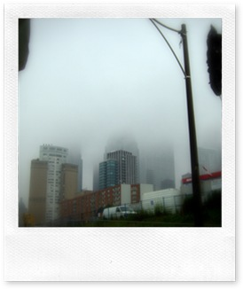

>  
> 
> Nonostante sulla carta oggi, 22 Giugno, sia il secondo giorno ufficiale dell’estate 2010, Toronto si è svegliata sotto un cielo cupo e piovoso. I 13°C delle 7:00 del mattino si sono elevati addirittura ai 21°C dell’ora di pranzo, ma la pioggia intermittente ed il cielo coperto hanno regalato un’umidità per nulla gradevole.

La sensazione è che il clima della città si stia adattando a quello politico dei prossimi giorni, con l’arrivo dei leader mondiali e la zona rossa (ad un isolato dal nostro albergo) che da domani diventerà off limit.

Oggi, comunque, la vita ha continuato a scorrere normalmente, offrendomi la visione di una metropoli di cinque milioni di abitanti che dà la sensazione di una tranquilla cittadina di provincia.

Un luogo dove convivono contraddizioni urbanistiche molto evidenti, soprattutto tra odierno e passato, ma che trasmette una forte sensazione di equilibrio di valori, tra spazi, densità, attenzione all’ambiente e (soprattutto) convivenza civile. 

Di fronte a certi normali atteggiamenti di civiltà che noto continuamente andando in giro per la città, mi ritrovo poi ad immaginare quale sarà il mio malessere una volta rientrato a Roma, di fronte al totale rifiuto di comportamenti votati all’educazione, al buon senso ed al rispetto degli altri che si registrano quotidianamente nelle nostre città.

    

(continua)
