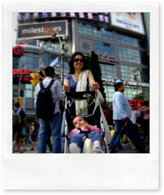

> 
> 
> Dopo la pioggia esce sempre il sole

 

Oggi è estate, finalmente. Il sole ci ha accompagnato (quasi) ininterrottamente dall’alba al tramonto e questo ci ha permesso di muoverci con maggiore libertà per la città.

Toronto inizia a sentire sulla propria pelle l’avvicinarsi del summit. Qualsiasi mezzo di informazione, dalla TV fino ai volantini incollati sulle vetrine dei negozi, ricordano i “confini” invisibili della Zona Rossa ed invitano cittadini e visitatori a starne lontani.

In effetti si è notata una maggiore presenza di polizia (soprattutto in bicicletta) ma al momento anche nel quadrilatero caldo tutto è tranquillo.

A proposito di confini invisibili, comunque, domani scriverò alcune impressioni su quelli di Toronto dove, come ogni grande città che si rispetti, il cambiamento  di condizione sociale e tipologia urbana si alternano con una forte evidenza.

Stamattina, invece,  abbiamo visitato un parco-fattoria dove i bambini delle scuole primarie possono entrare in contatto con gli animali che naturalmente in città non vivono.

Cavalli, muli, vitelli, pecore e mucche vengono mostrati e spiegati ai piccoli visitatori e ai parenti ed insegnanti che li accompagnano, creando un vero e proprio angolo di campagna praticamente nel centro della città.

Un ultimo dettaglio: gratuitamente (come l’accesso wifi dell’albergo, d’altronde, che mi permette di mettere on-line i miei deliri…)

