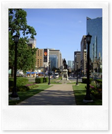
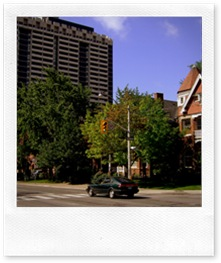

 **de confini, summit et diversae amenitatis…**

I due giorni di silenzio sul racconto di questo viaggio canadese sono legati a stanchezza, nient’altro per fortuna.

Le immagini che ieri hanno fatto il giro del mondo, con gli assalti dei black bloc alla Zona rossa della città, possono avere creato qualche apprensione. La maggior parte delle manifestazioni, a partire dal mattino (vedi foto del corteso anti-proibizionsita) sono state pacifiche. Ma naturalmente a chi decide di sfruttare la visibilità mediatica per sfogare la propria passione per il vandalismo non interessa.

In questi casi mi viene da pensare che se non ci fossero telecamere e reporter al seguito di queste situazioni, probabilmente non succederebbe nulla o quasi.

Il fatto che l’altro giorno accennassi ai “confini invisibili” è legato anche a questo elemento. Sono molte, infatti, le situazioni di degrado ed “imbarazzo” sociale in tutte le località del mondo ma, non essendoci enfasi mediatica, vengono quotidianamente ignorate a scapito di quattro teppisti che spesso non hanno nessun motivo per fare ciò che fanno.

Questo che vedete di seguito è il Queen’s Park il giorno prima della manifestazione:

 

Qui non c’era nulla da distruggere se non la natura e le costruzioni universitarie (che sono state adeguatamente presidiate) e quindi la violenza si è abbattuta a pochi isolati da qui, contro vetrine ed auto della polizia (anche delle TV, a dire il vero…).

Credo che anche questo sia indicativo di un confine invisibile, dove  anche un teppista “avverte” dove si può fare danno e dove “non ne vale la pena”.

In città ne ho incontrati parecchi di questi confini, facilitati anche dal fatto che Toronto si sviluppa in piano sulle sponde del lago Ontario, senza ostacoli naturali.  Questo è anche uno dei motivi per cui molte persone si spostano in bicicletta.

E lo stesso elemento rende più semplice la continua commistione tra nuovo e tradizionale anche sotto il profilo urbanistico.

 

Speriamo che oggi non piova a dirotto come ieri, così possiamo dedicarci al vecchio quartiere sud-orientale della città. A domani!

